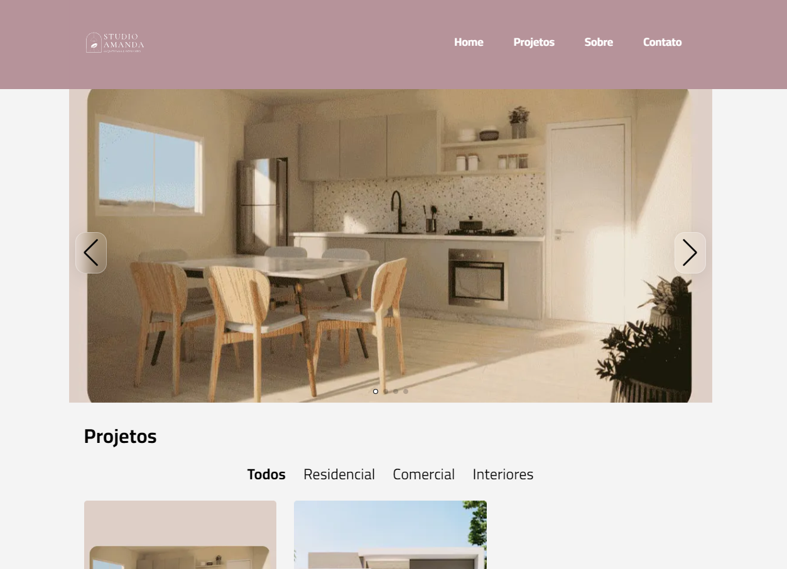

<h1 align="center">
  Studio Amanda Borges
</h1>



<div align="center">
  <a href="README-en.md">English</a>
  ·
  <a href="README.md">Português</a>
</div>

## 💬 Description

This is the online portfolio of architect Amanda Borges. In it you can learn a little more about her main projects, a brief description about her and how you can get in touch.

## 🚀 Technologies

### Front-end

- [NextJS](https://nextjs.org/) - Framework (based on the [ReactJS](https://react.dev/) library) used to build interfaces
- [Google Fonts](https://fonts.google.com/) - Library containing various fonts
- [Swiper](https://swiperjs.com/) - Component for creating carousels
- [Yet Another React Lightbox](https://yet-another-react-lightbox.com/) - Image preview component
- [Tailwind CSS](https://tailwindcss.com/) - CSS framework for styling
- [Jest](https://jestjs.io/) - Automated testing framework
- [Testing Library](https://testing-library.com/) - Automated Testing Library

#### Layout

You can view the project layout through [this link](https://www.figma.com/file/IEfItaPTEcPpxmHFbwy2LM/Studio-Amanda-Borges?type=design&node-id=5%3A4&t=JzoWEJRzrGCYYN0m-1).

### Back-end

- [DatoCMS](https://www.datocms.com/) - CMS
- [API GraphQL](https://graphql.org/)
- [Mock Service Worker](https://mswjs.io/) - JavaScript library used to create API simulations in front-end applications. It allows you to intercept and manipulate network requests made by the browser, providing mocked responses without the need to modify the application code

## 🚀 Getting started

First of all you need to have [Node.js](https://nodejs.org/) and [npm](https://www.npmjs.com/) installed on your machine.

Then you can clone the repository.

```code
  git clone https://github.com/zehguilherme/studio-amanda-borges
```

Start the application

1. `cd web`
2. `npm install`
3. `npm run dev`

## ✅ Tests

### Unit tests

1. `cd web`
2. `npm run test`

## 🤔 How to contribute

1. Fork the project;
2. Create your feature branch: `git checkout -b my-new-feature`;
3. Commit your changes: `git commit -m 'feat: Add some feature'`;
4. Push to the branch: `git push origin my-new-feature`;
5. Create a new Pull Request;
6. After the merge of your pull request is done, you can delete your branch.

---

Made with 💟 by José Guilherme Paro Monteiro Tomaine 👋 [Talk to me!](https://www.linkedin.com/in/josé-guilherme-paro-monteiro-tomaine/)
