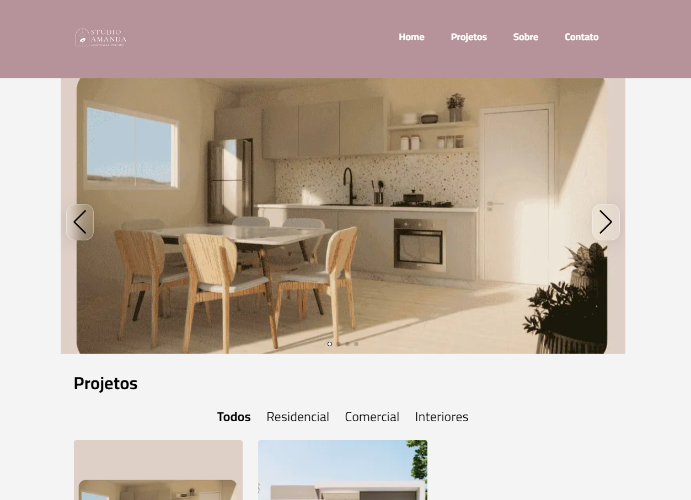

<h1 align="center">
  Studio Amanda Borges
</h1>



<div align="center">
  <a href="README-en.md">English</a>
  ·
  <a href="README.md">Português</a>
</div>

## 💬 Descrição

Este é o portfólio online da arquieta Amanda Borges. Nele você pode conhecer um pouco mais sobre seus principais projetos, uma breve descrição sobre ela e como pode entrar em contato.

## 🚀 Tecnologias

### Front-end

- [NextJS](https://nextjs.org/) - Framework (baseado na biblioteca [ReactJS](https://react.dev/)) usado para construção de interfaces
- [Google Fonts](https://fonts.google.com/) - Biblioteca contendo diversas fontes
- [Swiper](https://swiperjs.com/) - Componente para criação de carrosséis
- [Yet Another React Lightbox](https://yet-another-react-lightbox.com/) - Componente de visualização de imagens
- [Tailwind CSS](https://tailwindcss.com/) - Framework CSS para estilização
- [Jest](https://jestjs.io/) - Framework de testes automatizados
- [Testing Library](https://testing-library.com/) - Biblioteca de testes automatizados

#### Layout

Você pode visualizar o layout do projeto através [deste link](https://www.figma.com/file/IEfItaPTEcPpxmHFbwy2LM/Studio-Amanda-Borges?type=design&node-id=5%3A4&t=JzoWEJRzrGCYYN0m-1).

### Back-end

- [DatoCMS](https://www.datocms.com/) - CMS
- [API GraphQL](https://graphql.org/)

## 🚀 Começando

Primeiro de tudo você precisa ter `node` e `yarn` (ou `npm`) instalados em sua máquina.

*Se você decidir usar o npm, não se esqueça de deletar `yarn.lock` nas pastas.*

Então você pode clonar o repositório.

```code
  git clone https://github.com/zehguilherme/studio-amanda-borges
```

Inicie a aplicação

1. `cd web`
2. `yarn` ou `npm install`
3. `yarn dev` ou `npm run dev`

## ✅ Testes

### Testes unitários

1. `cd web`
2. `yarn test` ou `npm run test`

## 🤔 Como contribuir

1. Faça um fork do projeto;
2. Crie uma branch com a sua feature: `git checkout -b minha-nova-feature`;
3. Faça commit das suas alterações: `git commit -m 'feat: Adição de uma nova feature'`;
4. Faça push para o branch: `git push origin minha-nova-feature`;
5. Crie uma nova Pull Request;
6. Depois que o merge de sua Pull Request for concluída, você pode excluir sua branch.

---

Feito com 💟 por José Guilherme Paro Monteiro Tomaine 👋 [Fale comigo!](https://www.linkedin.com/in/josé-guilherme-paro-monteiro-tomaine/)
